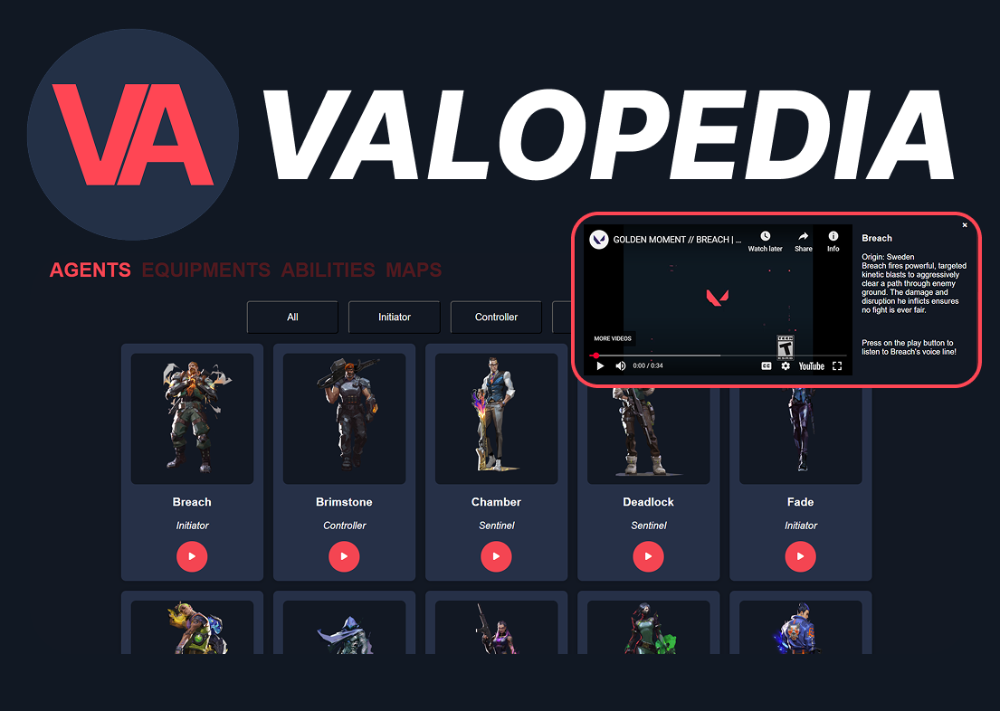

# SEA Stage 2 - Data Catalog Project

# Valopedia

> It's your time to shine as the best player!

Valopedia is an interactive catalog website that helps new and curious players learn more about the world of Valorant — Riot Games' popular tactical shooter.

# Features

1. **Agent Catalog**: Explore official Valorant agents and their roles.
2. **Voice Line Player**: Click on any agent to hear one of their iconic voice lines.
3. **Agent Filtering**: Agent filtered by roles.

# Motivation

 Starting Valorant as a new player can feel overwhelming due to the wide range of agents, abilities, and maps. Valopedia simplifies this learning curve by giving players a visual and auditory reference in one central place. 

# Future improvements

1. Add informations about **maps** in Valorant.
2. Explore each agents **abilities**.
3. **Preview** of each agents abilities and ultimate.
